# Getting Started on CyVerse

CyVerse provides cloud computing for running the project notebooks without needing a powerful local machine. This guide walks through everything you need to get up and running.

## Overview

Each CyVerse session runs in a fresh container. Here is what **persists** between sessions and what does not:

| | Persists? |
|---|---|
| Files in `/home/jovyan/data-store/` | Yes — this is your permanent storage |
| Cloned repositories (if saved to data-store) | Yes |
| Conda environments in `/opt/conda/envs/` | **No** — so this project builds its env at a `--prefix` inside `data-store` instead |
| Environments baked into the image (e.g. `HYR-SENSE`) | Yes |
| Jupyter kernel registrations | **No** — must be re-registered each session |
| GitHub SSH credentials | **No** — must be recreated each session |

The setup below is one command. The first run takes a couple of minutes; later sessions take seconds because everything except the kernel registration lives in `data-store`.

---

## Prerequisites

Before your first session, make sure you have:

- **CyVerse account** — [user.cyverse.org](https://user.cyverse.org/)
- **GitHub account** — [github.com](https://github.com)
- **NASA Earthdata account** — [urs.earthdata.nasa.gov](https://urs.earthdata.nasa.gov/) (required for `earthaccess` to download HLS and EMIT data)

---

## Step 1: Log in to CyVerse

1. Go to [user.cyverse.org](https://user.cyverse.org/)

   

2. Click `Sign up` if you do not already have an account.

   

3. Head to the CyVerse Discovery Environment at [de.cyverse.org](https://de.cyverse.org) and log in.

   

   You should see the Discovery Environment dashboard:

   

---

## Step 2: Launch JupyterLab

1. From the Discovery Environment, click `Apps` in the left menu.
   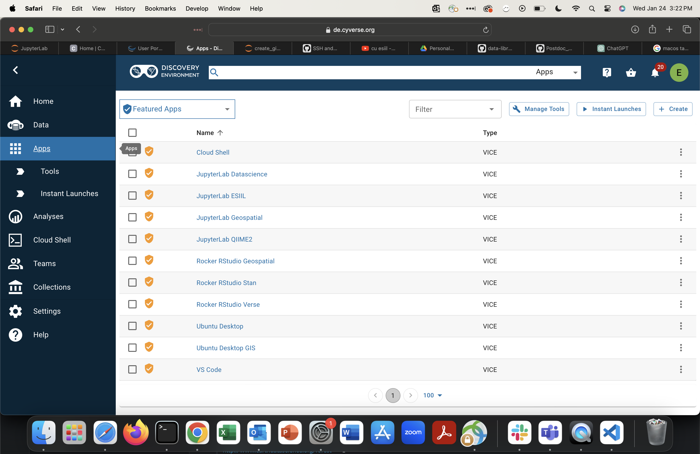

2. Select `JupyterLab ESIIL`.
   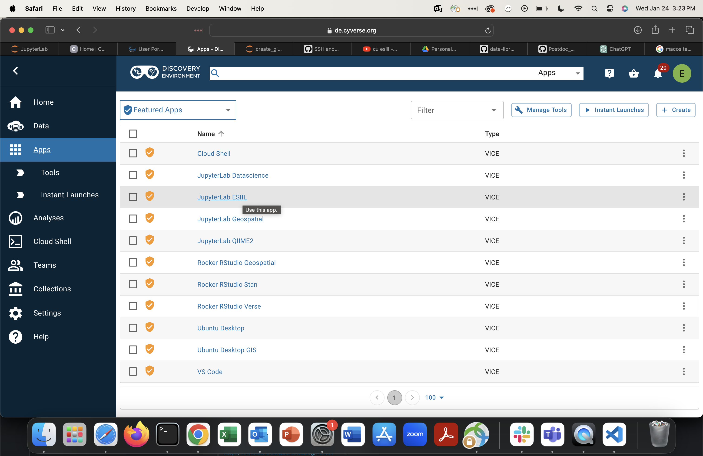

3. Configure your analysis. Set disk size to **64 GB or greater**. Adjust CPU/memory as needed.
   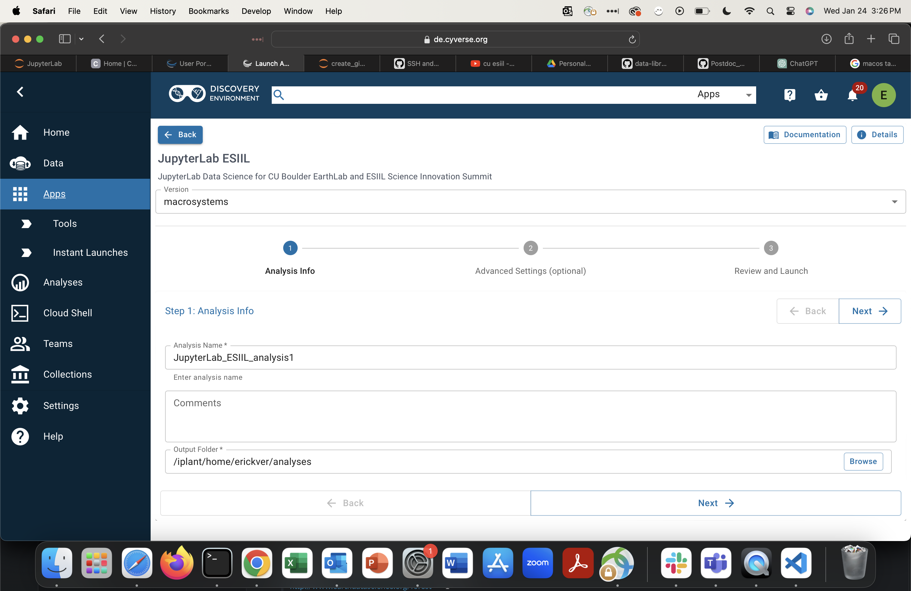
   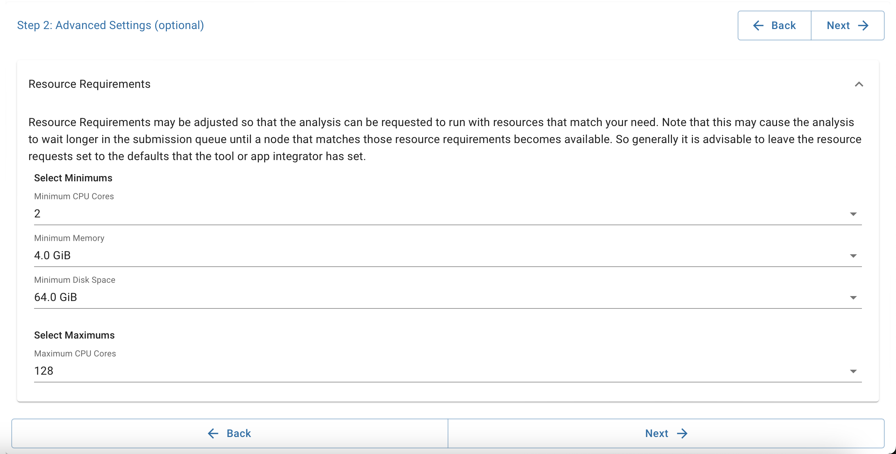
   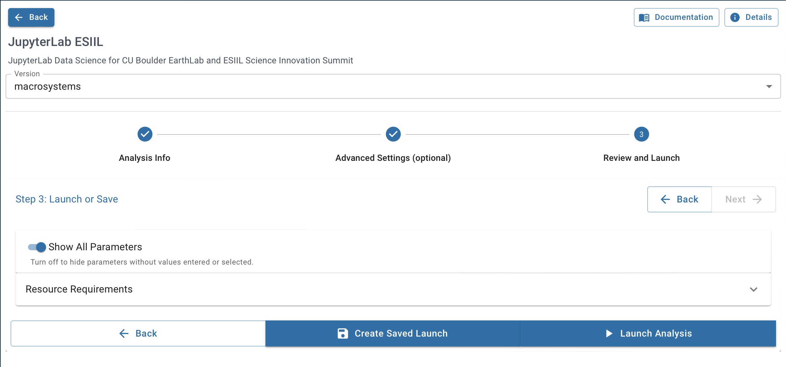

4. Click `Go to analysis`.
   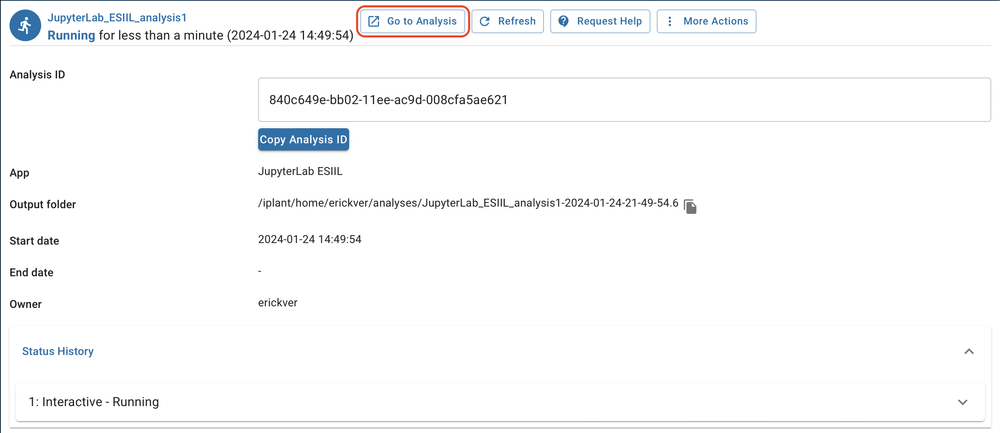

5. JupyterLab will open in your browser.
   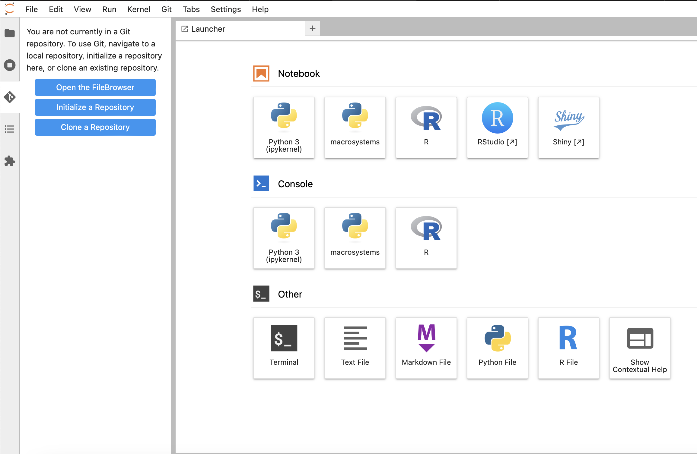

---

## Step 3: Set Up the Project Environment

Open a terminal in JupyterLab (**File → New → Terminal**).

**1. Clone the repository** (only needed if not already in your data-store):
```bash
cd ~/data-store
git clone https://github.com/CU-ESIIL/Public-Observing-Unci-Maka.git
cd Public-Observing-Unci-Maka
```

If already cloned, just pull the latest changes:
```bash
cd ~/data-store/Public-Observing-Unci-Maka
git pull
```

**2. Run the setup script**:
```bash
bash ~/data-store/Public-Observing-Unci-Maka/scripts/setup_cyverse.sh
```

**3. Refresh the browser tab** (JupyterLab only fetches the kernel list on page load), then pick **"Python (Unci Maka / VBET)"** from the kernel picker.

That is the whole setup. Re-run the script at the start of each session — the first run takes a couple of minutes, later ones take seconds.

### What the script does, and why

It builds a **self-contained conda environment from `environment.yml` at a prefix inside
`~/data-store`**, then registers it as a Jupyter kernel.

Conda environments do not have to live in `/opt/conda/envs`. `--prefix` puts one anywhere, so
placing it in `data-store` makes it persist across sessions. It is built **once** (10–20 minutes)
and reused forever after.

| | Approach |
|---|---|
| `mamba env create` into `/opt/conda/envs` | Self-consistent, but wiped every session — 10–20 min each time. |
| A venv with `--system-site-packages` over `HYR-SENSE` | **Does not work** — see below. |
| **`mamba env create --prefix ~/data-store/envs/unci-maka`** | Self-consistent *and* persistent. Built once. |

Specifically it:

1. Removes any leftover venv at the target path from the older, broken approach.
2. Builds the conda env from `environment.yml` (skipped if it already exists).
3. **Verifies the stack before registering the kernel** — numpy/pandas/pyarrow ABI, the
   geospatial stack, `pyproj.CRS.from_epsg(32613)`, and `pynhd` (which pulls aiohttp). A broken
   env never reaches a notebook.
4. Downloads the ~200 MB WhiteboxTools binary once into `~/data-store/bin/WBT`.
5. Registers the kernel with `PROJ_DATA`, `GDAL_DATA` and `WBT_PATH` baked in, and
   prunes dead kernels that point into `data-store/envs` (image kernels are never touched).

Only step 5 repeats each session.

### Why not layer on top of HYR-SENSE

An earlier version of this script built a venv with `--system-site-packages` on top of the
image's `HYR-SENSE` environment, to avoid rebuilding the geospatial stack. **That does not
work**, and it fails in two opposite directions at the same time:

* `pip` installs a **new** NumPy into the venv. Venv `site-packages` shadows the base env, so the
  new NumPy sits in front of HYR-SENSE's `pandas` and `pyarrow`, which are compiled against the
  NumPy 1.x ABI:
  ```
  AttributeError: _ARRAY_API not found
  ```
* `pip` simultaneously **skips** upgrading `aiohttp`, because HYR-SENSE's older copy appears to
  satisfy the requirement. Imports then resolve to a version missing newer symbols:
  ```
  ImportError: cannot import name 'ClientConnectorDNSError' from 'aiohttp'
  ```

HYR-SENSE is Python 3.10 with a pinned older stack; this project needs a modern one. A
site-packages tree with mixed provenance cannot be made consistent by installing more things into
it. Use the standalone environment, and **do not run these notebooks on the HYR-SENSE kernel**.

### Using a different environment location

```bash
ENV_DIR=~/data-store/envs/somewhere-else bash scripts/setup_cyverse.sh
```
To rebuild from scratch, add `--recreate`.

### Using a different base environment

### Where things are written

| Path | Persists? |
|---|---|
| `~/data-store/envs/unci-maka` — conda env | Yes |
| `~/data-store/bin/WBT` — WhiteboxTools binary | Yes |
| `<repo>/data` — DEM, HAND, VBET outputs (repo is in data-store) | Yes |
| `/opt/conda/envs/hyr-sense` — image env (**not used** by these notebooks) | Yes |
| Jupyter kernel registration | **No** — re-run the script |

---

## Step 4: Set Up GitHub Credentials

GitHub SSH credentials are tied to each CyVerse container and must be recreated each session. You only need to do this if you want to push changes back to GitHub.

### Video walkthrough
<a href="https://www.youtube.com/watch?v=nOwOzPJEQbU">
    
</a>

1. From JupyterLab, click the **Git Extension** icon in the left sidebar.
   

2. Click `Clone a Repository`, paste the cyverse-utils URL below, and click `Clone`:
   ```
   https://github.com/CU-ESIIL/cyverse-utils.git
   ```
   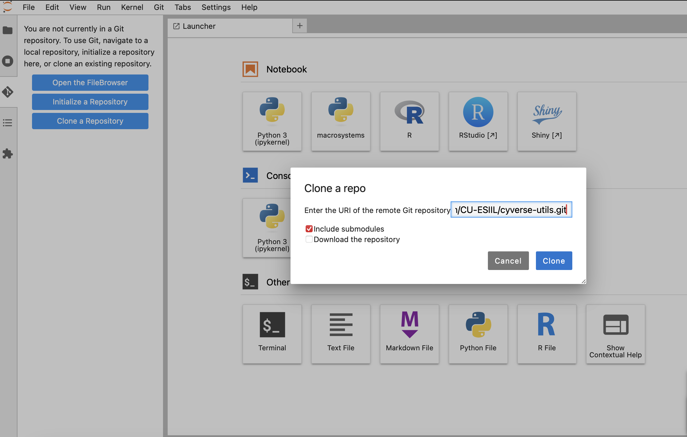

3. You should now see the `cyverse-utils` folder in your directory tree (from the default `/home/jovyan/data-store` directory).
   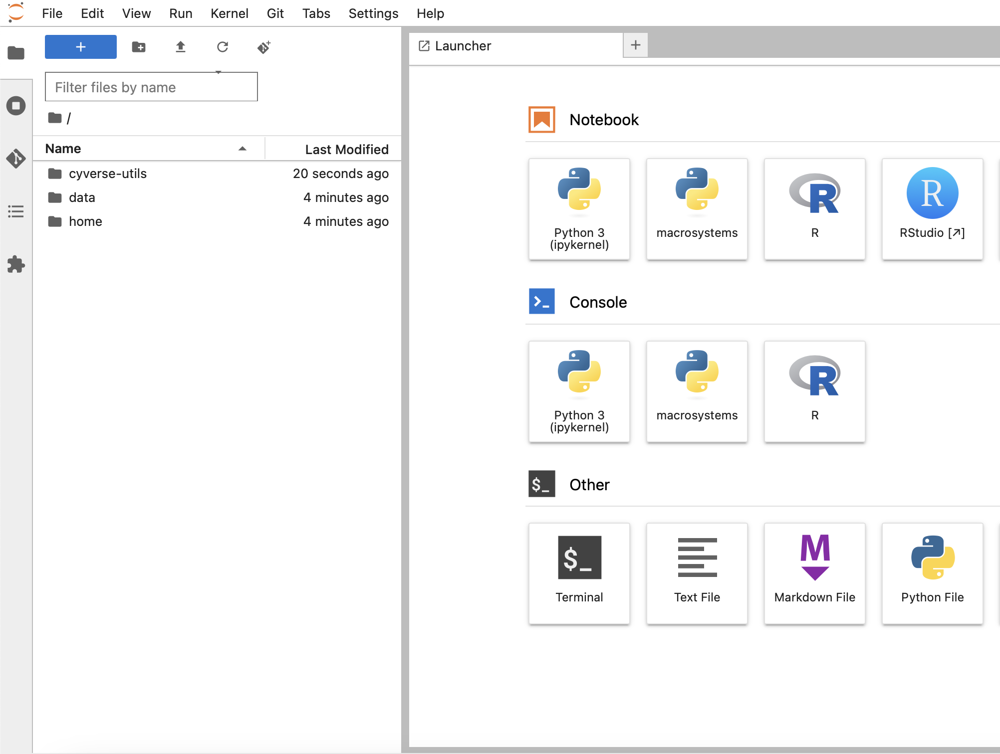

4. Open the `cyverse-utils` folder.
   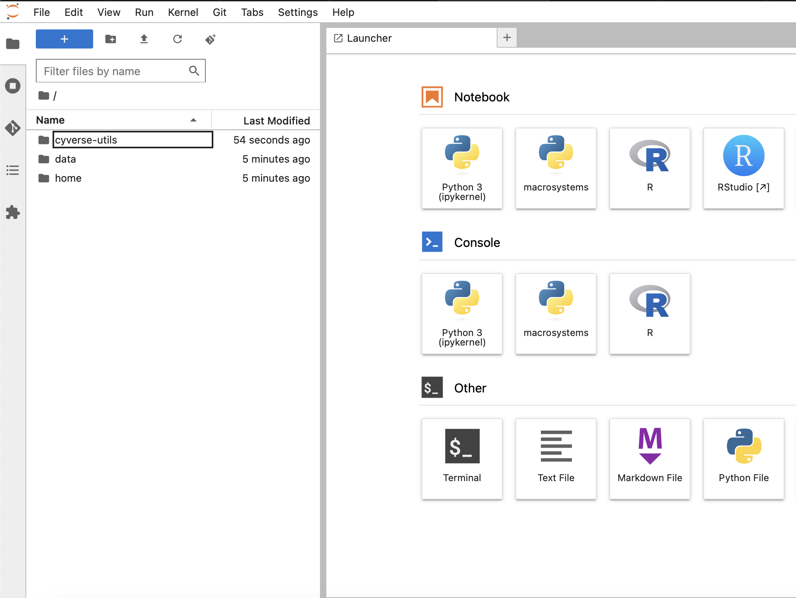

5. Open `create_github_keypair.ipynb` (Python) or `create_github_keypair.R` (R).
   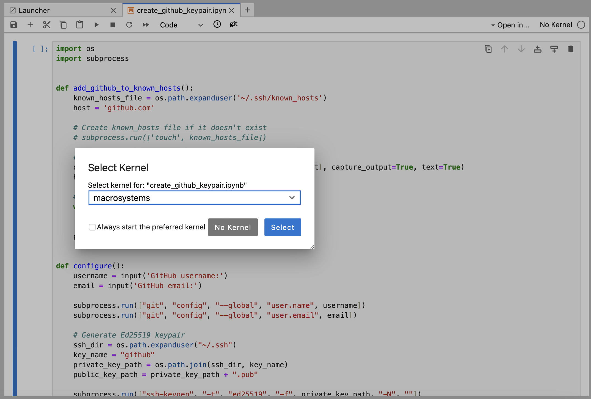

6. Click the **play** button. Enter your GitHub username and email when prompted.
   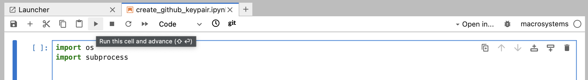
   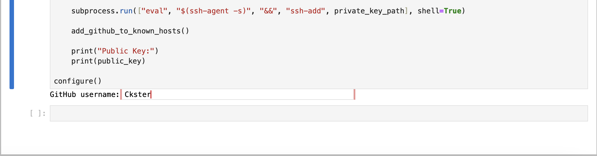
   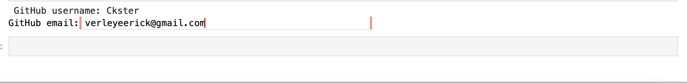

7. Copy the entire public key line, including `ssh-ed25519` at the start and `jovyan@...` at the end.
   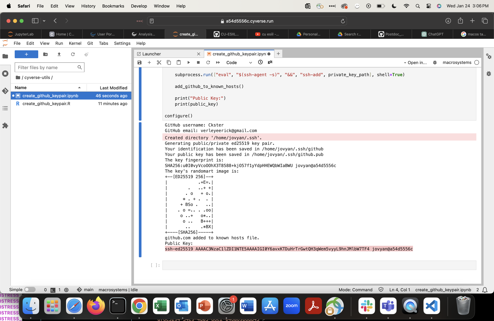

8. Go to your [GitHub Settings](https://github.com/settings/keys) page.
   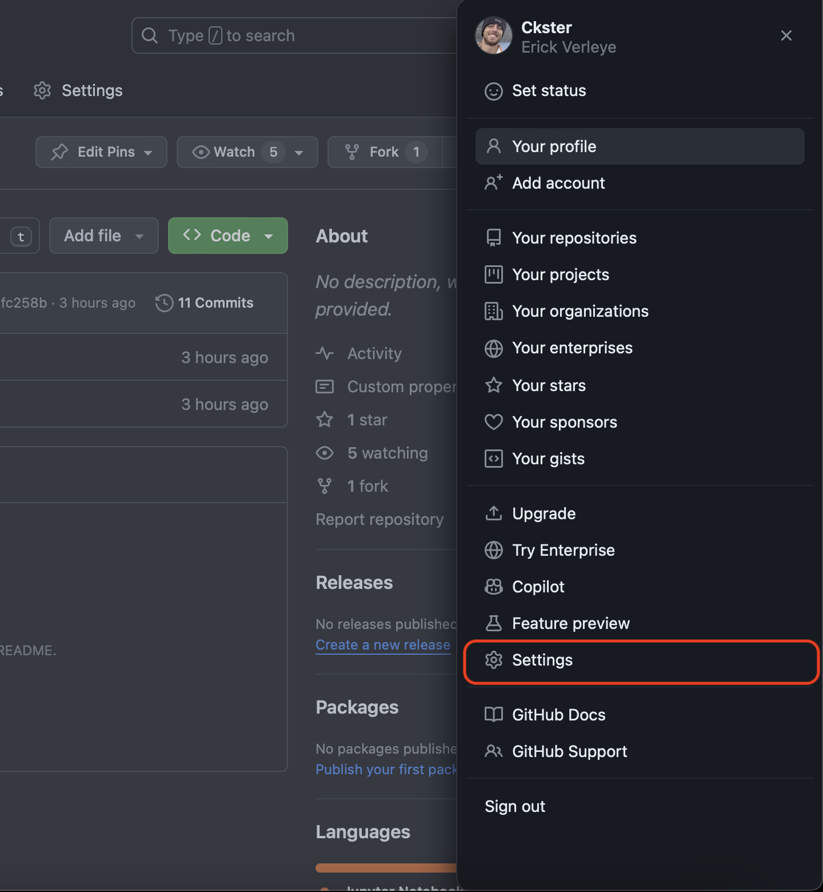

9. Select `SSH and GPG keys`.
   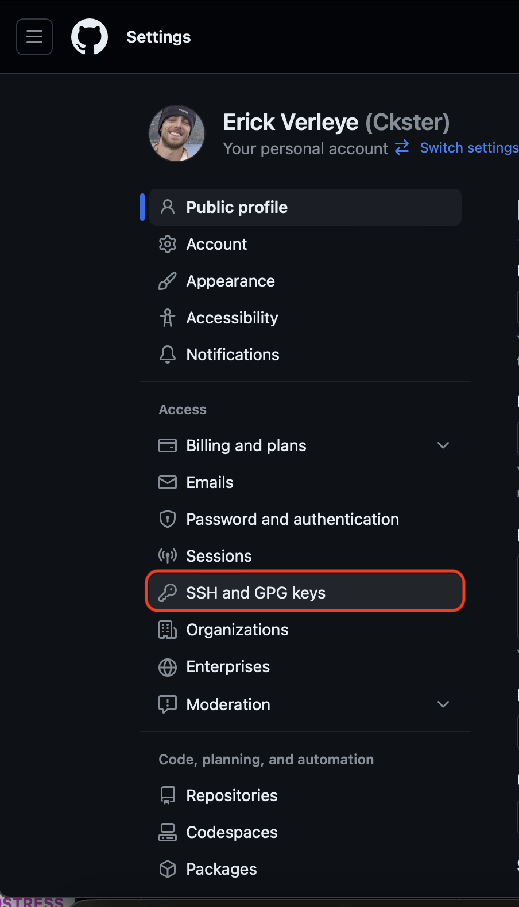

10. Click `New SSH key`.
    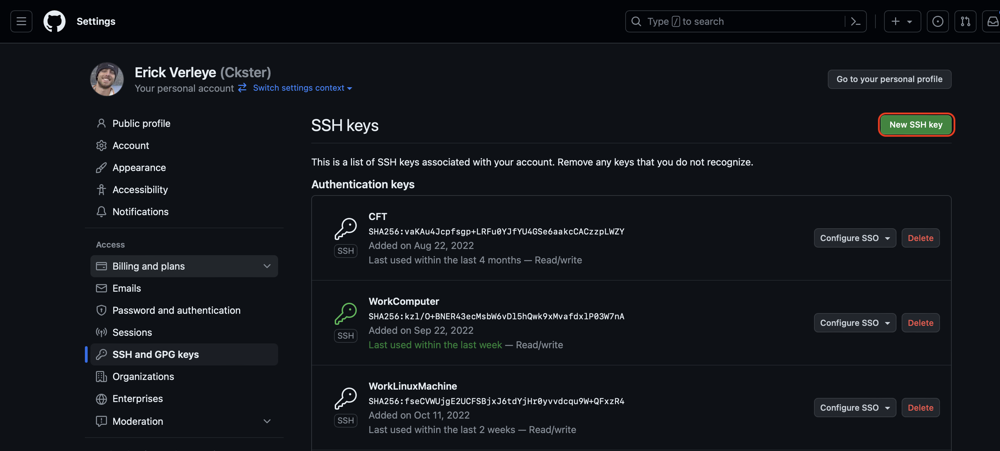

11. Give it a name, paste the full public key, and click `Add SSH Key`.
    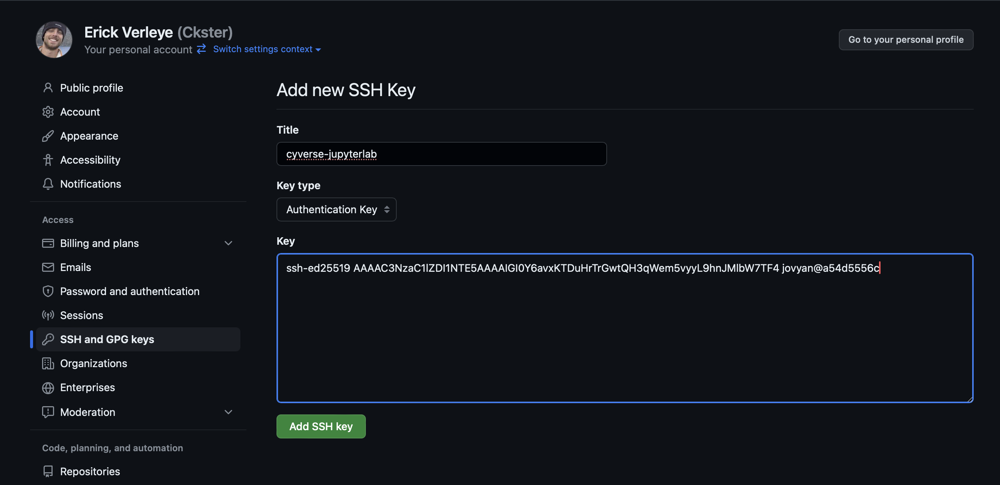

12. Your key will appear in the list. You can now clone private repos and push changes.
    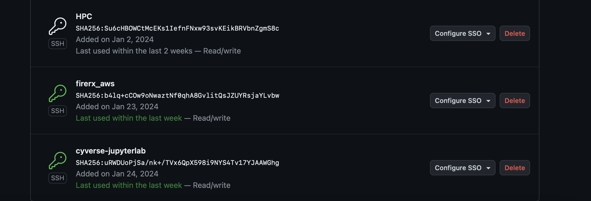

> **Note:** This SSH key is tied to the current container. When you start a new CyVerse analysis, repeat this step. You can delete old keys from GitHub at any time.

---

## Troubleshooting

### Kernel "Python (Unci Maka / VBET)" is missing, or the notebook cannot import `whitebox`
Kernel registrations do not survive a session restart. Re-run:
```bash
bash ~/data-store/Public-Observing-Unci-Maka/scripts/setup_cyverse.sh
```
then **refresh the browser tab**.

### `_ARRAY_API not found` or `cannot import name 'ClientConnectorDNSError'`
You are running on the **HYR-SENSE kernel**, not the project kernel. Switch to
**"Python (Unci Maka / VBET)"** via *Kernel -> Change Kernel*, then restart the kernel.
See "Why not layer on top of HYR-SENSE" above for why these two errors appear together.

### The environment is broken or half-built
Rebuild it from scratch (this discards and re-solves; the WBT binary and your data are kept):
```bash
bash scripts/setup_cyverse.sh --recreate
```

### Building the standalone environment instead
`environment.yml` still describes a complete, self-contained env if you need one
(local machines, or a CyVerse image without a usable base env):
```bash
conda config --set fetch_threads 1 && conda config --set extract_threads 1
mamba env create -f environment.yml
```
This is slow on CyVerse and can exhaust container memory — prefer the overlay.

### `CRSError: Invalid projection` or `pyproj unable to set PROJ database path`
The PROJ environment variables are not being passed to the kernel. Re-run the `ipykernel install` command from Step 3.4 (which embeds the paths in the kernel spec), then restart the kernel.

If the error persists, add this as the **very first cell** in the notebook, before any other imports:
```python
import os, sys
os.environ['PROJ_DATA'] = os.path.join(sys.prefix, 'share', 'proj')
os.environ['PROJ_LIB'] = os.path.join(sys.prefix, 'share', 'proj')
```

### `earthaccess` login / NASA Earthdata errors
You need a free NASA Earthdata account at [urs.earthdata.nasa.gov](https://urs.earthdata.nasa.gov/). When `earthaccess.login()` prompts for credentials, use your Earthdata username and password (not your GitHub credentials).

### Kernel not appearing in the picker after install
Click the browser **Refresh** button (not just the JupyterLab reload). The kernel list is fetched on page load.
