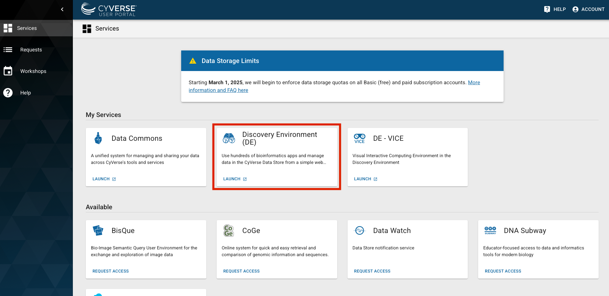
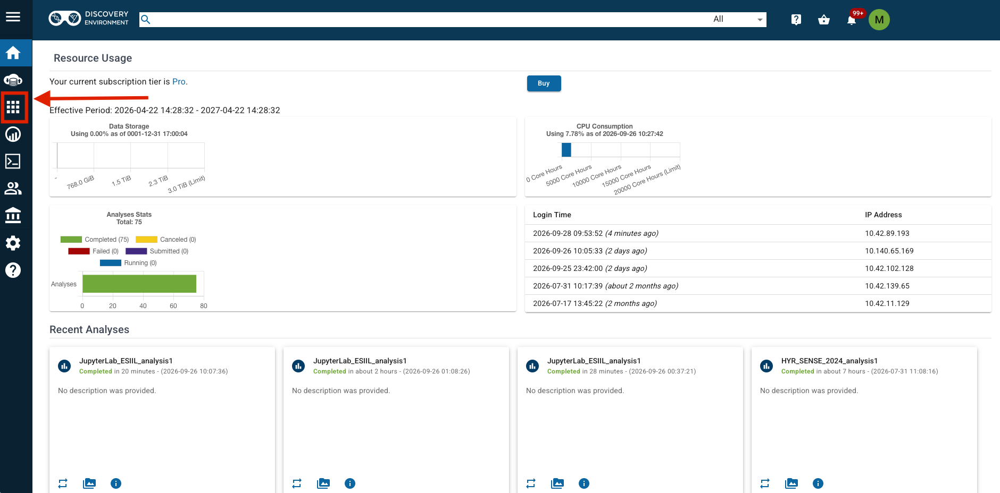
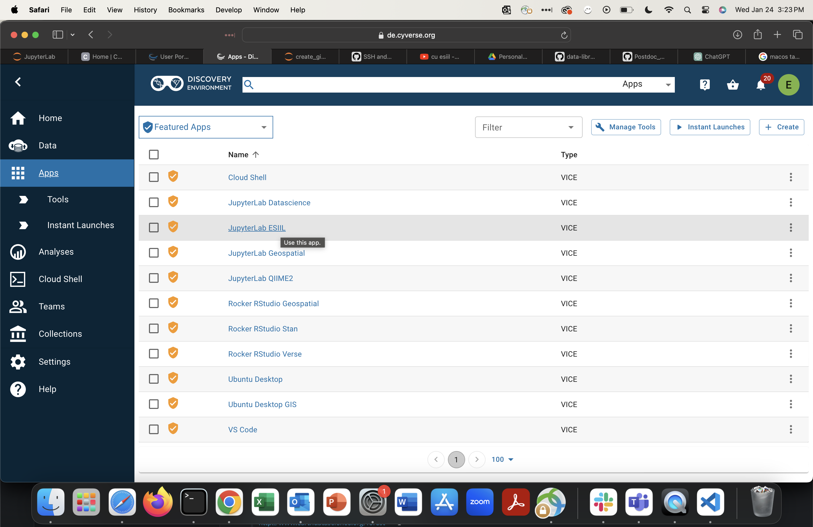
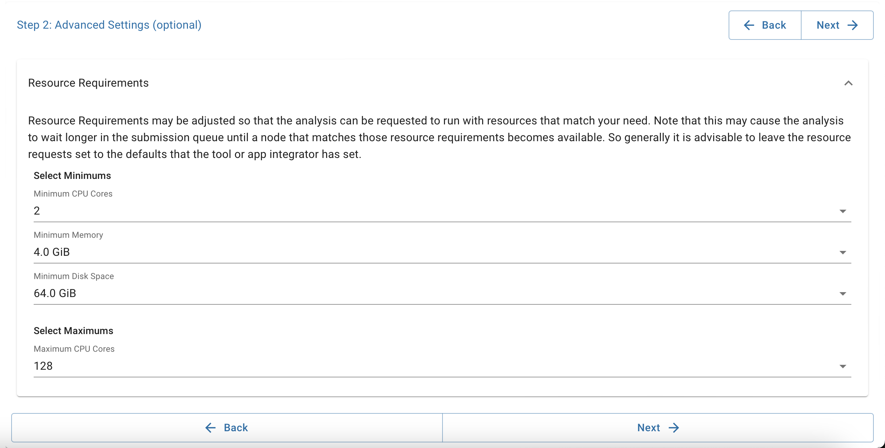
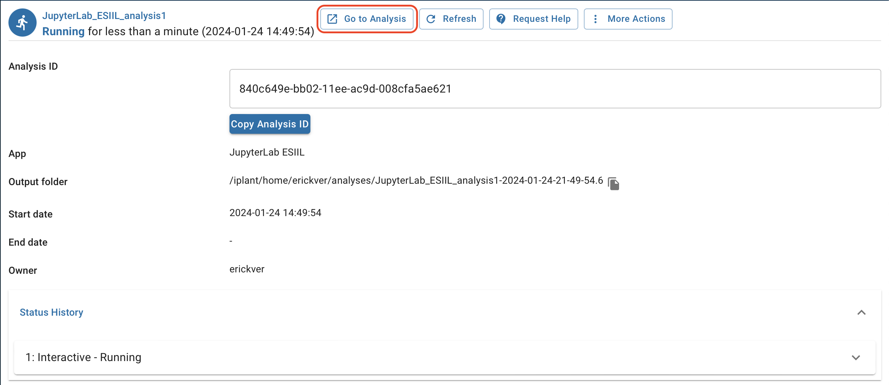

# Running the notebooks on CyVerse

CyVerse gives you a cloud computer with JupyterLab already installed, so nothing
runs on your own laptop. This page gets you from a CyVerse login to a running
notebook. Pushing changes back to GitHub is optional and covered at the end.

**You need:** a [CyVerse account](https://user.cyverse.org/) (email
maxwell.cook@colorado.edu for access to the ESIIL app), and a
[NASA Earthdata account](https://urs.earthdata.nasa.gov/) if you will use the
EMIT or HLS notebooks. A GitHub account is only needed to push changes.

**One thing to know about CyVerse.** Each analysis you launch is a fresh
machine. When it ends, everything on it is erased *except* one folder:
`data-store/home/<your-cyverse-username>`. The code and Python environment are
set up fresh each time (about 5 to 10 minutes). Anything you want to keep, copy
into that folder before the analysis ends.

---

## 1. Open JupyterLab

These are the same steps as ESIIL's
[general CyVerse guide](https://cu-esiil.github.io/Postdoc_OASIS/resources/cyverse_basics/#open-up-an-analysis-with-the-hackathon-environment-jupyter-lab),
which has more screenshots if you get stuck.

1. Log in at [user.cyverse.org](https://user.cyverse.org/). Under **My
   Services**, click **Launch** on **Discovery Environment**.
   
2. Click the **Apps** icon (the grid of squares) in the left bar.
   
3. Click **JupyterLab ESIIL** in the list.
   
4. Click **Launch Analysis**, then **Next** until you reach **Step 2: Advanced
   Settings**. Set the resources using the table below, then keep clicking
   **Next** and finally **Launch**.
   
5. Click **Go to analysis** and wait for JupyterLab to open. This can take a
   minute or two.
   

**How big a machine to ask for.** Bigger is not better: the group shares a
fixed number of core-hours, and larger requests wait longer in the queue.

| Setting | Use | Why |
|---|---|---|
| Minimum CPU cores | **4** | The terrain tools use several cores; the rest of the notebooks use one. |
| Minimum memory | **8 GiB** | Enough for every notebook at the default 30 m terrain resolution. Use **16 GiB** if you change `DEM_RES_M` to 10. |
| Minimum disk | **64 GiB** | Holds the environment, downloaded terrain tiles, and outputs. |
| Maximum CPU cores | leave as is | |

---

## 2. Every time you start an analysis: get the code and build the environment

Open a terminal in JupyterLab: **File → New → Terminal**. Then run these one at
a time.

Download the project:

```bash
git clone https://github.com/CU-ESIIL/Public-Observing-Unci-Maka.git
```

Build the Python environment. This takes about 5 to 10 minutes:

```bash
bash ~/Public-Observing-Unci-Maka/scripts/setup_cyverse.sh
```

When it prints `== Done`, **refresh your browser tab**. That is the whole setup.

If you need to run the script again during the same analysis, for example
after a kernel goes missing, it finishes in seconds.

---

## 3. Run a notebook

1. In the file browser on the left, open `Public-Observing-Unci-Maka` →
   `notebooks` → `PineRidge`.
2. Double-click a notebook to open it.
3. In the top-right corner of the notebook, click the kernel name and choose
   **Python (Unci Maka / VBET)**. Do not use HYR-SENSE; it is an older
   environment that these notebooks cannot run on.
4. Run cells from the top with **Shift + Enter**, or run everything with
   **Run → Run All Cells**.

**Run them in this order.** Start with `checks/01s_VBET_SmokeTest.ipynb`, which
runs in seconds and confirms the environment works. Then `00_Study_Area`,
`01_VBET_ValleyBottom`, and `03_NAIP_Segmentation_Labels`. Notebooks `02` and
`04` to `08` are outlines the group is still filling in.

Results are written to the `data` and `figures` folders inside the project.
They are never uploaded to GitHub, and they are erased with the analysis.

**To keep results**, copy them to your persistent folder before the analysis
ends. Replace `<username>` with your CyVerse username:

```bash
cp -r ~/Public-Observing-Unci-Maka/data ~/data-store/home/<username>/unci-maka-data
```

---

## Optional: push your changes to GitHub

Skip this section if you only want to run the notebooks.

GitHub needs to know who you are before it accepts changes. You also need write
access to the repository; ask Max if you do not have it. Do this **once**:

```bash
bash ~/Public-Observing-Unci-Maka/scripts/setup_github.sh
```

It asks for your GitHub username and email, then prints a long line starting
with `ssh-ed25519`. Copy that whole line, go to
[github.com/settings/ssh/new](https://github.com/settings/ssh/new), paste it in
the **Key** box, give it any title, and click **Add SSH key**.

Check that it worked. You should see `Hi <your-username>!`:

```bash
ssh -T git@github.com
```

The key is saved in your persistent folder, and the setup script in section 2
restores it every analysis, so you will not need to do this again. Never share
the `.ssh` folder inside your persistent folder with anyone. If you think the
key has been exposed, delete it on GitHub and run the script again. (ESIIL's
[general CyVerse guide](https://cu-esiil.github.io/Postdoc_OASIS/resources/cyverse_basics/#set-up-your-github-credentials)
shows another way to create a key, but that key is lost when the analysis ends.)

**To send your changes**, from the project folder:

```bash
git add -A
```

```bash
git commit -m "describe what you changed"
```

```bash
git push
```

---

## Something went wrong

**The kernel "Python (Unci Maka / VBET)" is not in the list.** Run the setup
script from section 2 and refresh the browser tab. The list is only read when
the page loads.

**The notebook shows `_ARRAY_API not found` or `ClientConnectorDNSError`.** It
is running on the HYR-SENSE kernel. Click the kernel name in the top right,
choose **Python (Unci Maka / VBET)**, then **Kernel → Restart Kernel**.

**The setup script crashed while building the environment.** The machine ran
out of memory. Launch the analysis again with more memory and start over from
section 2.

**A cell fails with a PROJ or CRS error.** Restart the kernel
(**Kernel → Restart Kernel**). If it persists, run the setup script again.

**`earthaccess` asks for a login.** Use your NASA Earthdata username and
password, not your GitHub or CyVerse login.

**`git push` says permission denied.** Either the key was not added to GitHub
(repeat the optional section), or you do not have write access to the
repository.

**The GitHub script says it cannot find your persistent folder.** Look in the
file browser for `data-store` → `home` and note the folder with your username,
then run the script as:

```bash
PERSIST_DIR=~/data-store/home/<username> bash ~/Public-Observing-Unci-Maka/scripts/setup_github.sh
```
